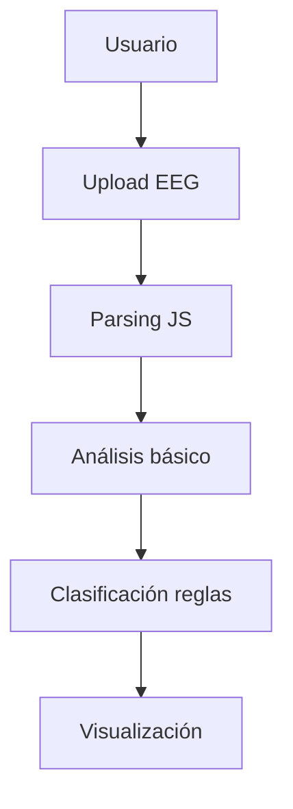
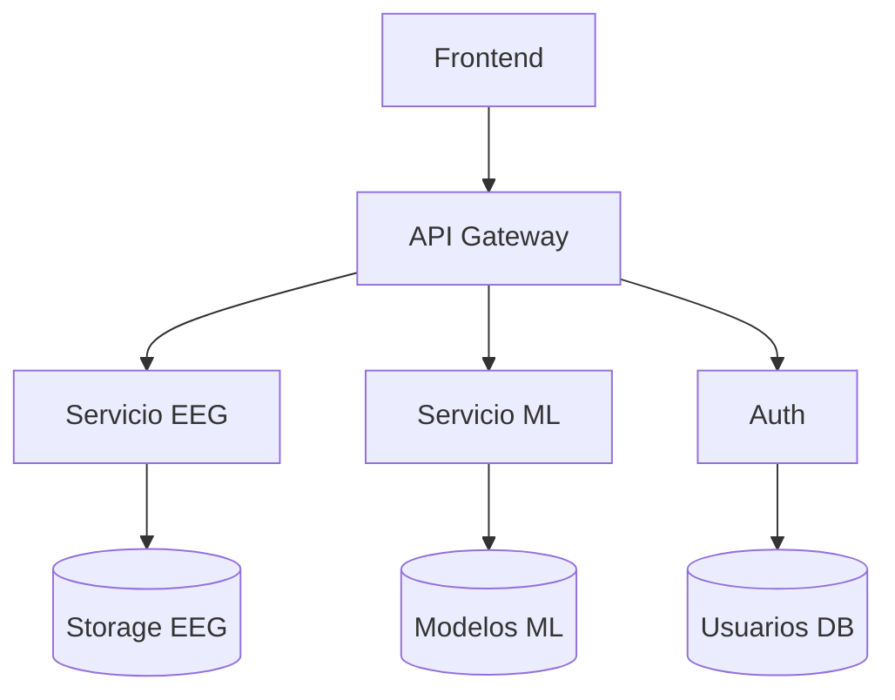
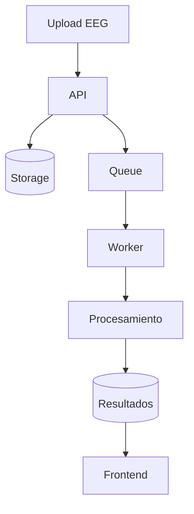
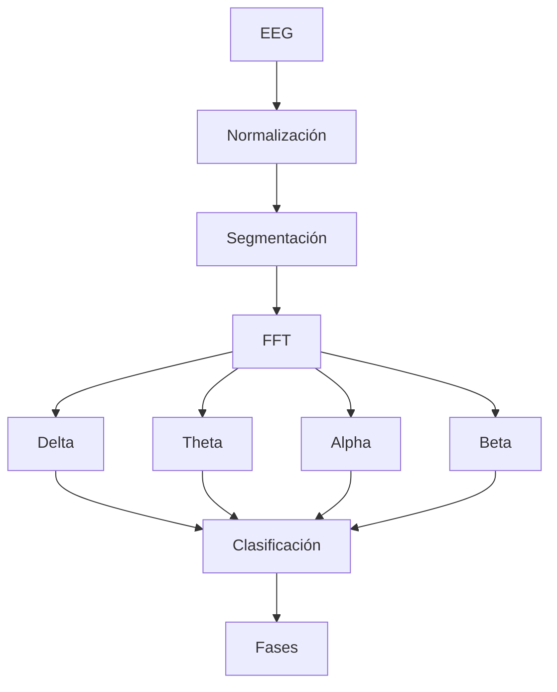
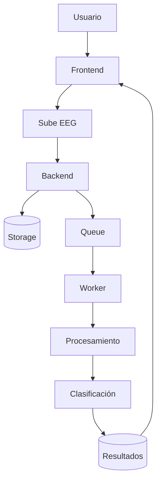
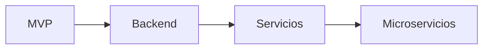

# plataforma-egg---hackton-v0
proyecto desarrollado para la presentación de la hakaton
# 🧠 EEG Brain Phase Classifier

Aplicación web para analizar señales de electroencefalograma (EEG) y convertirlas en **fases del cerebro** (vigilia, sueño ligero, profundo, REM).

---

# 🚀 Visión

Democratizar el análisis de EEG haciéndolo visual, accesible y rápido desde el navegador.

---

# 🧩 Arquitectura

## 🧠 MVP (Frontend Only)











```mermaid
flowchart TD
    A[Usuario]
    B[API]
    C[(Storage)]
    D[Queue]
    E[Worker]
    F[Procesamiento]
    G[(Resultados)]
    H[Frontend]

    A --> B
    B --> C
    B --> D
    D --> E
    E --> F
    F --> G
    G --> H
